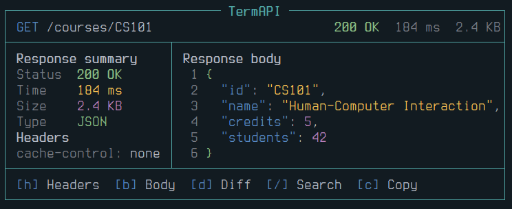
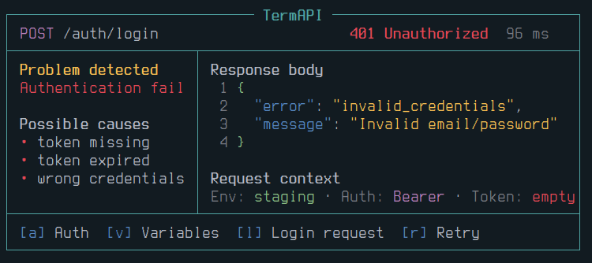

<!-- class: invert -->

<!-- _class: invert lead -->

**FFT projekt · emberközpontú felülettervezés**

# TermAPI

_Billentyűzetközpontú TUI alkalmazás API-k felfedezésére, tesztelésére és hibakeresésére._

`TUI` · `API client` · `Ratatui` · `UX design`

---

## Probléma és motiváció

### Valós probléma

API-fejlesztés közben a fejlesztők gyakran váltanak dokumentáció, Postman/Insomnia, terminál, logok és környezeti változók között.

### TermAPI válasza

Egy terminálból használható API kliens, amely strukturált request buildert, endpoint böngészőt és hibakeresési kontextust ad.

**Motiváció:** kevesebb kontextusváltás, gyorsabb billentyűzetes munkafolyamat, érthetőbb API-hibák.

---

## Célközönség és personák

### Bence · junior backend fejlesztő

- **Cél:** endpointok gyors tesztelése fejlesztés közben.
- **Fájdalom:** rossz environment, hiányzó header, nehezen diagnosztizálható 401/500 hibák.
- **Helyzet:** lokális API után stagingen is ellenőrzi ugyanazt a requestet.

### Réka · full-stack fejlesztő

- **Cél:** frontend integráció előtt gyorsan ellenőrizni a válaszstruktúrát.
- **Fájdalom:** sok kattintás GUI kliensekben, nehezen kereshető history, secret adatok láthatósága.
- **Helyzet:** staging és production response-okat hasonlít össze.

---

## Felhasználói kutatás · szintetikus adatok

[kutatasi-jegyzokonyv.md](kutatasi-jegyzokonyv.md)

### 7 kérdőívválasz

5 fejlesztő, 2 informatikus hallgató. API tesztelési szokások, toolhasználat, leggyakoribb hibák.

### 3 rövid interjú

15–20 perces beszélgetések: endpoint tesztelés, environment váltás, auth hibák, request megosztás.

### 4 összehasonlított tool

Postman, Insomnia, cURL/HTTPie és Swagger UI használati mintáinak elemzése.

---

## Felhasználói kutatás · eredmények

**Fő megállapítás:** a felhasználók nem csak requestet akarnak küldeni, hanem gyorsan érteni akarják, miért sikertelen egy request.

---

## Kutatási pain pointok

| Megfigyelés                                                                 | Következmény a tervezésben                         |
| --------------------------------------------------------------------------- | -------------------------------------------------- |
| 6/7 válaszadó vált legalább két eszköz között API teszteléskor              | egy felületen endpoint, request és response        |
| 5/7 válaszadó hibázott már environment vagy token miatt                     | aktív environment mindig látható, secret maszkolás |
| 4/7 válaszadó szerint a GUI kliensek lassúak egyszerű ismételt requestekhez | billentyűzetközpontú flow és command palette       |
| Interjúkban visszatérő gond: 401/403 hibák okának kiderítése                | Error Debugging nézet request contexttel           |

---

## Piackutatás · meglévő megoldások

| Megoldás      | Erősség                       | Gyengeség                               | TermAPI iránya                            |
| ------------- | ----------------------------- | --------------------------------------- | ----------------------------------------- |
| Postman       | gazdag funkciók, collectionök | GUI-heavy, sok kattintás                | gyorsabb billentyűzetes flow              |
| Insomnia      | tiszta API kliens             | desktop GUI, terminálból kiszakít       | terminálban maradó workflow               |
| cURL / HTTPie | gyors, scriptelhető           | kevés vizuális állapot, kezdőknek nehéz | strukturált TUI réteg                     |
| Swagger UI    | jó endpoint dokumentáció      | korlátozott debugging                   | OpenAPI + request builder + error context |

**Piaci rés:** Postman-szerű struktúra + cURL-szerű gyorsaság + TUI-alapú hibakeresési támogatás.

---

## Fő use case-ek

```text
Felhasználó
   │
   ├─ OpenAPI specifikáció importálása
   ├─ Endpoint keresése vagy böngészése
   ├─ Request összeállítása
   │    ├─ Params
   │    ├─ Headers
   │    ├─ Auth
   │    └─ Body
   ├─ Request futtatása
   ├─ Response elemzése
   ├─ Hiba diagnosztizálása
   └─ Request mentése / exportálása / összehasonlítása
```

---

## Lo-Fi prototípus · szerkezeti döntések

```text
┌──────────────────────────── TermAPI ────────────────────────────┐
│ Collection: Course API              Env: staging  Auth: Bearer  │
├─────────────────────┬───────────────────────────────────────────┤
│ Endpoints           │ Endpoint details / Request editor         │
│ Auth                │ GET /courses/{courseId}                   │
│   POST /auth/login  │                                           │
│ Courses             │ Path params                               │
│ ▸ GET /courses/{id} │   courseId [ CS101 ]                      │
│   POST /courses     │ Query params                              │
│ Users               │   includeStudents [ true ▾ ]              │
├─────────────────────┴───────────────────────────────────────────┤
│ [/] Search  [Tab] Panel  [e] Edit  [r] Run  [?] Help            │
└─────────────────────────────────────────────────────────────────┘
```

A Lo-Fi változat a panelstruktúrát, navigációt és információs hierarchiát rögzítette, nem a végleges vizuális stílust.

---

## High-Fidelity irány · terminálkompatibilis színek

### Alapelv

A TermAPI nem kényszerít saját teljes színtémát. Alapértelmezésben a felhasználó terminál témája érvényesül.
A saját színeink csak szemantikus jelzések: fókusz, státusz, hiba, figyelmeztetés.

### Kompatibilitás

- ANSI / terminal-safe színek használata.
- Ne függjön egyetlen konkrét háttérszíntől.
- Világos és sötét terminal theme mellett is olvasható maradjon.
- Szín mellett szöveges badge is jelzi az állapotot: `200 OK`, `401`, `ERR`.

---

## Példa szemantikus színrendszerre

| UI elem             | Szerep                   | Példa megjelenés                  |
| ------------------- | ------------------------ | --------------------------------- |
| Aktív panel         | fókusz jelölése          | cyan border / fordított kijelölés |
| GET / POST / DELETE | method gyors felismerése | kék / zöld / piros badge          |
| 2xx / 4xx / 5xx     | response állapot         | zöld / sárga / piros badge        |
| Secret value        | érzékeny adat            | maszkolt, halvány szöveg          |
| Shortcut bar        | tanulhatóság             | terminál téma szerinti muted text |

**Design döntés:** a szín nem dekoráció, hanem gyors visszajelzés. A felület akkor is érthető, ha a színek eltérően jelennek meg különböző terminal theme-ekben.

---

## Hi-Fi képernyő · Response viewer



---

## Hi-Fi képernyő · Error debugging



---

## Tervezési döntések

### TUI és billentyűzet

- A célcsoport terminálban dolgozik.
- A gyakori műveletek rövidítésekkel gyorsíthatók.
- Az alsó shortcut bar csökkenti a tanulási terhet.

### Hibakeresési támogatás

- A státuszkód önmagában kevés.
- A request context megmutatja az aktív environmentet, auth módot és változókat.
- A hiba nézet konkrét ellenőrzési irányokat ad.

---

## Felületek értékelése (szintetikus)


[ertekeles-jegyzokonyv.md](ertekeles-jegyzokonyv.md)

### Tesztelés

- 3 résztvevő: 2 fejlesztő, 1 hallgató.
- Feladatok: endpoint keresés, request futtatás, 401 hiba javítása, cURL export.
- Módszer: megfigyelés + rövid utóinterjú.

### Eredmények

- Az endpoint browser egyértelmű volt.
- Az aktív environmentet többen későn vették észre.
- A 401 hiba nézetet hasznosnak ítélték.
- A shortcutok tanulásához állandó segítség kellett.

---

## Visszajelzések alapján módosított elemek

| Probléma                            | Módosítás                                                | UX indoklás           |
| ----------------------------------- | -------------------------------------------------------- | --------------------- |
| Environment nem volt eléggé feltűnő | felső sávba került állandó `Env` badge                   | hibamegelőzés         |
| Shortcutok nehezen tanulhatók       | minden képernyő alján kontextusfüggő shortcut bar        | tanulhatóság          |
| 401 hiba oka nem volt világos       | Error Debugging nézetbe bekerült a Request Context panel | gyorsabb diagnosztika |
| Secret értékek láthatók lehettek    | alapértelmezett maszkolás                                | biztonság és bizalom  |

---

## Személyes tapasztalat és továbbfejlesztés

### Tanulság

A TUI nem „kevesebb design”, hanem más interakciós modell. A legnagyobb kihívás az volt, hogy a gyors billentyűzetes használat ne menjen a tanulhatóság rovására.

### További lehetőségek

- GraphQL schema browser.
- Staging / production response diff.
- Plugin rendszer formatterekhez és auth módokhoz.
- Egyszerű API contract tesztek.

---

# TermAPI

_Terminálos API kliens, amely nem csak requestet küld, hanem segít megérteni, javítani és dokumentálni az API-használat folyamatát._

`API discovery` · `request builder` · `error context` · `human-centered TUI`
